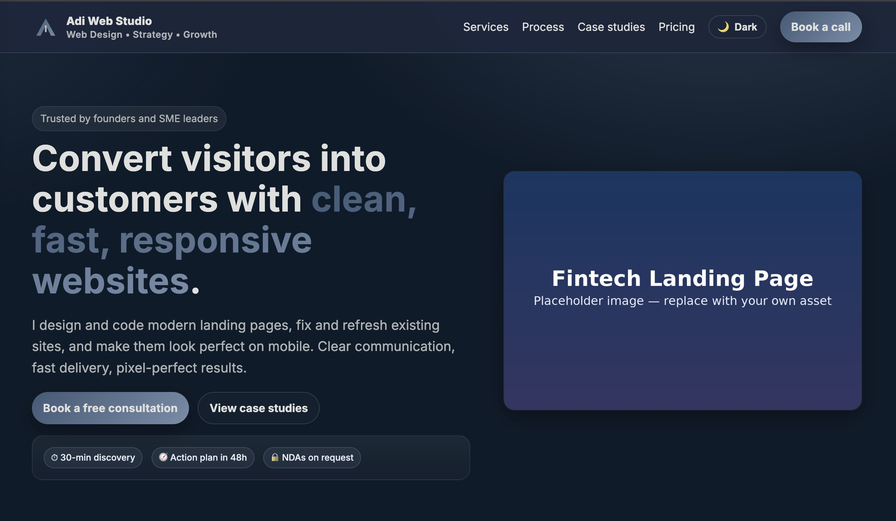

# 💼 Fintech Landing Page

A clean, fast, and responsive **business consulting landing page** designed for startups and fintech companies.  
Built with **HTML, CSS, and JavaScript**, focused on clarity, speed, and conversion.

🔗 **Live Demo:** [https://adiwebstudio.netlify.app](https://adiwebstudio.netlify.app)

---

## ✨ Features

- ⚡ Fully responsive across all devices  
- 🎨 Built with semantic HTML5, modern CSS3, and vanilla JS  
- 🧭 Smooth scroll navigation and fixed topbar  
- 📊 Clean typography and visual hierarchy  
- 🌙 Light & dark theme ready  
- 🚀 Deployed via [Netlify](https://www.netlify.com/)

---

## 🧱 Tech Stack

| Technology | Description |
|-------------|-------------|
| **HTML5** | Structured and semantic markup |
| **CSS3 / Flexbox / Grid** | Responsive design and layout |
| **JavaScript (ES6)** | Interactive UI and form validation |
| **Netlify** | Hosting and continuous deployment |
| **Figma (Design phase)** | Wireframes and colour system |

---

## 🎨 Colour Palette

| Name | Hex | Use |
|------|-----|-----|
| Pumpkin | `#ff6700` | Accent / brand colour |
| Polynesian Blue | `#004e98` | Primary background |
| Bice Blue | `#3a6ea5` | Highlights |
| Silver | `#c0c0c0` | Muted text |
| Anti-flash White | `#ebebeb` | Light background |

---

## 🖼️ Preview



---

## ⚙️ Installation (Local Preview)

```bash
# Clone the repository
git clone https://github.com/adiadila123/fintech-landing.git

# Open in browser
cd fintech-landing
open index.html
